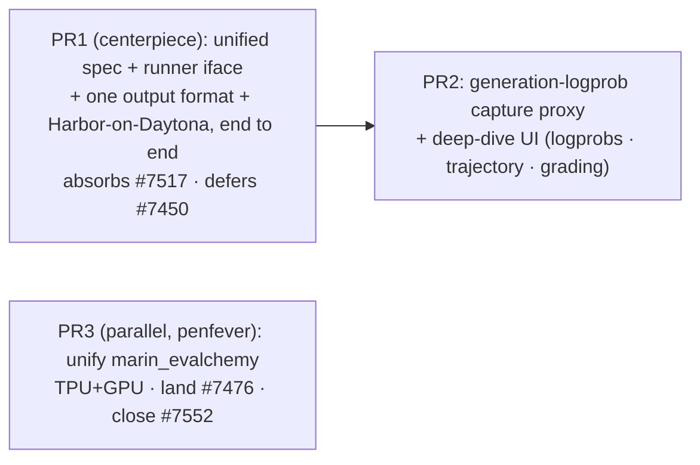

# Eval rollup: unified spec, Harbor-on-Daytona, and one eval-output format

Coordinator design for GitHub issue #7559 ("integrate harbor evals"). Target workflow: a user names a
model, and Marin stands it up, runs the evalchemy **and** Harbor suites against it (on Iris/GCP or
Daytona), normalizes every run into one output format, and surfaces it in evaldash — raw prompts,
answers, grading, and (where feasible) logprobs inspectable per prediction.

Rev 2. Reviewed independently by codex and `claude --model fable` against the code; they converged on
the same eight structural problems with rev 1, all incorporated below. **No backward compatibility:**
existing eval outputs can be deleted and repopulated.

## Rev 3 — finalized execution scope (owner decision, 2026-07-23)

The maintainer collapsed this to **one PR** with these adjustments to the Rev 2 plan:
- **Launcher unification folds in.** The `experiments/evaluation` group launcher (records + evaldash,
  already TPU+GPU) is the single system. The standalone self-serve launchers
  (`marin_evalchemy_tpu.py`, #7476, #7552) are superseded and closed against this PR; the valuable
  model-intelligence from #7476 — `auto_serve_overrides` (derives vLLM flags + clamps `max_model_len`
  from a model's `config.json`) and `extra_gen_kwargs` — is grafted into `serve_and_eval.py` as the
  substance of "unified model definitions."
- **No generation-logprob capture** and **no evaldash UI work.** The evaldash summary view is the
  surface. The v2 sample contract still lands (explicit `Grading`, agentic fields) since Harbor and
  evalchemy share it; the `generation_logprobs` field is dropped from scope.
- **#7517 is not absorbed.** Harbor drives Daytona itself (`harbor.EnvironmentType.DAYTONA` creates
  sandboxes from `DAYTONA_API_KEY`); #7517's client is an audit/reclaim ops tool off the eval path, so
  it stays independent. Only the credential bridge is needed: `eval_env.daytona_sdk_env` maps the GSM
  `DAYTONA_EVAL_API_KEY` to the SDK's `DAYTONA_API_KEY`.
- **Capability-URL minting is available programmatically:** `client.mint_endpoint_token(...)` +
  `rigging.connect.capability_path(name, token)` (the `iris endpoints mint` internals). The Harbor
  runner mints one from the served endpoint for in-sandbox agents; a client-side agent (aime) can use
  the in-VPC `base_url` directly, so the first live smoke uses aime.
- **Deliverable:** the merged PR + an example evaldash URL to a real Harbor and evalchemy run.

Delivered (branch `weaver/eval-rollup`): the v2 `Grading` sample contract + column-projecting evaldash
reader; the generalized record (`eval_image`, `HarborRef`, `EvalRef.tasks` optional); the `eval_env`
module + Daytona credential bridge; the `auto_serve_overrides` graft (derives vLLM flags + clamps
`max_model_len` from `config.json`); `HarborSpec` + the Harbor runner that runs a registry dataset as
an isolated `uv` subprocess (`harbor` + `daytona`, kept out of the marin lock) against the served
endpoint and normalizes each trial into a record + agentic samples; the `run_eval_group` Harbor
dispatch; and deletion of the standalone launcher. The evalchemy path is validated live (mmlu smoke
lands a v2 record + graded samples); the Harbor-on-Daytona path is validated live against `aime`.
Sections 5–7 below are the superseded Rev 2 multi-PR plan, retained for the reasoning trail.

## 1. Current state (the evidence)

Two disjoint eval worlds exist today; the plan collapses them onto one output format.

**A. The new eval system** (`experiments/evaluation/` + `experiments/evals/evalchemy/` +
`marin.evaluation.{records,samples,eval_result}`):
- `EvalModelConfig` (`experiments/evaluation/models.py`) — the model registry (HF id or `gs://`/`s3://`
  export, `hbm_gb`, backend, serve overrides).
- `EvalSuiteConfig` + `EvalMechanism` (`experiments/evaluation/evals.py`) — the eval registry.
  `EvalMechanism.HARBOR` **is a declared enum value but unwired**: `plan_runs` raises
  `NotImplementedError` for it (`launch.py:281`). `EvalSuiteConfig` carries only lm-eval `tasks`.
- Orchestrator `run_eval_group` (`launch.py:142`): serve once, run each eval against the shared
  endpoint via `run_eval_units`, read metrics via `EvalchemyResult(...).task_metrics()` (`:170`),
  write one `record.json` per eval (shared `group_id`). Runs on a **1 CPU / 4 GB** job; its env is
  set from `env_vars_from_keys(HARBOR_EVAL_ENV_KEYS)` **imported from `harbor_evaluator.py`**
  (`launch.py:31,421`).
- `EvalRunRecord` (`records.py`) → `{prefix}/{run_id}/record.json` (GCS `gs://marin-eval-metadata/runs`,
  CW S3). `evaluation: EvalRef{name, mechanism, tasks: tuple[EvalTaskRef]}`, `Provenance.evalchemy_image`
  (required), `metrics: {task:{metric:float}}`.
- `EvalSample` (`samples.py`, `SCHEMA_VERSION=1`) → `samples_<task>_<ts>.parquet`, the only columnar
  format in the path: prompt, `choices[{label,text,loglikelihood,is_greedy}]`, output, extracted,
  target, metrics, correct, `doc`. Regenerated CPU-only from the kept `samples_*.jsonl`
  (`export_lm_eval_samples`) — no re-serve needed.
- evaldash (`infra/evaldash/`) — Starlette + Vue on Cloud Run, IAP-gated. Ingestor globs `record.json`
  into Cloud SQL Postgres. **The sample reader loads the entire parquet, `to_pylist()`s it, and
  pydantic-validates every row on each page request** (`infra/evaldash/src/samples.py`).

**B. The legacy Harbor evaluator** (`marin/evaluation/evaluators/harbor_evaluator.py`): drives any
Harbor registry dataset, points a `hosted_vllm/<model>` agent at a served vLLM, writes its **own**
`results_*.json` + `samples_*.jsonl` + `trajectories/` + a W&B table — **never an `EvalRunRecord` or
`EvalSample`**, so evaldash never sees it. It carries real execution requirements: litellm
`model_info` construction, canonical-name sanitization (`:67-86`), and **GCS trial resume** (restore +
per-trial upload hooks, `:134-196`). `harbor_config.env ∈ {local,daytona,e2b}`;
`HARBOR_EVAL_ENV_KEYS` lists `DAYTONA_API_KEY` (**not** the GSM name `DAYTONA_EVAL_API_KEY`). Harbor
agents split by locus: `custom-vllm` runs **client-side** (calls `api_base`); `claude-code` /
terminal-bench run **inside the sandbox**. Separately, `marin/harbor/iris_environment.py` (#7288) runs
Harbor sandboxes as Iris jobs (prebuilt-image only) — the Iris-native alternative to Daytona.

**Constraints the reviewers surfaced (verified):**
- `run_evalchemy_client.py` runs `python -m eval.eval ... --log_samples` as a **subprocess**; the
  client never sees an API response, and lm-eval's saved `resps` are **plain text** for generation
  tasks. Per-token generation logprobs cannot be captured by adding a request flag.
- The TPU serve stack's logprob path is documented as **engine-killing** under load
  (`EVAL_SERVE_MAX_NUM_BATCHED_TOKENS=512`, `max_retries=8` for logprob-burst 500s).
- `ServedEndpoint.base_url` is an **in-cluster VPC** address; an off-cluster Daytona sandbox reaches a
  registered endpoint only through a **minted capability URL** (`/proxy/t/<token>/<endpoint>/...`,
  possession-is-credential; `iris endpoints mint <name>` or `marin-serve --access link`;
  `lib/iris/docs/iap-gclb.md`).
- Nothing imports `marin_evalchemy_tpu`/`_gpu` except docs; the group launcher drives `run_eval_units`
  directly, so unifying those standalone launchers (#7476/#7552) is **parallel**, not upstream.

**Secrets (verified via `gcloud secrets list`):** `DAYTONA_EVAL_API_KEY` (use this for evals),
`DAYTONA_DATA_API_KEY`, `DAYTONA_RL_API_KEY`. The only propagation in-path is `env_vars_from_keys`
copying the launch process env into the job — there is no GSM fetch anywhere in the path.

**Open PRs:** #7476 (draft, backend-agnostic `marin_evalchemy.py`) — land; #7552 (green, GPU launcher)
— close, superseded by #7476; #7450 (Harbor Dockerfile builds on Iris) — defer/close (Iris HarborEnv
stays as the prebuilt-image fallback; image builds move to Daytona/Cloud Build); #7517 (draft, Daytona
`marin/daytona/` client + `harbor/task_archive.py` parquet + `harbor_results.py`) — absorb; #7246
(draft, ~6k LOC agentic-evals package) — defer, gated on #7553→OT-Agent#53.

## 2. Design — one model + eval reference, one runner interface

Keep `EvalModelConfig` as the single model registry; both mechanisms serve the same model. Add a
Harbor variant to the suite registry so **one registry carries both mechanisms**:

```python
class HarborEnv(StrEnum):        # where the sandbox runs
    DAYTONA = "daytona"          # DAYTONA_EVAL_API_KEY; off-cluster
    IRIS = "iris"                # marin.harbor.iris_environment (#7288), prebuilt-image

@dataclass(frozen=True)
class HarborSpec:
    dataset: str                 # registry name or hf:// id
    version: str = "1.0"
    agent: str = "custom-vllm"   # client-side; in-sandbox agents (terminal-bench) need the proxy URL
    env: HarborEnv = HarborEnv.DAYTONA
    n_concurrent: int = 4
    max_output_tokens: int = 8192 # litellm budget — distinct from lm-eval's max_gen_toks
    agent_kwargs: dict = field(default_factory=dict)

@dataclass(frozen=True)
class EvalSuiteConfig:
    name: str
    mechanism: EvalMechanism
    tasks: tuple[EvalTaskConfig, ...] = ()   # evalchemy
    harbor: HarborSpec | None = None         # harbor
    max_gen_toks: int = 2048
    max_eval_instances: int | None = None
```

**Do not bolt `unit.mechanism` dispatch onto `run_eval_units`** — it rejects task-less units and its
restart-retry re-runs a *whole unit* after a serve move (catastrophic for hours-long Daytona trials).
Instead extract a mechanism-neutral runner from the serve lifecycle:

```python
class MechanismRunner(Protocol):
    def run(self, endpoint: ServedEndpoint, unit: EvalUnit) -> EvalUnitOutcome: ...
    # explicit resume / cancellation / result-collection semantics per mechanism
```

`run_eval_group` owns the serve session and picks a runner by `suite.mechanism`: `EvalchemyRunner`
wraps today's `run_eval_units` body; `HarborRunner` drives Harbor trials with **its own resume**
(preserve the GCS restore/upload hooks) against a **minted capability URL** for the endpoint.
Mechanism-neutral serve-death handling stays in the group; per-trial idempotency stays in the runner.
The Harbor runner needs the `harbor` extra and more than 1 CPU/4 GB, and Harbor suites get **their own
serve** (not a shared one pinned open for hours — matching `evals.py`'s existing per-suite-serve
rationale). `harbor_evaluator.py`'s reusable pieces (model_info, canonical-name sanitizer, resume
hooks, env-keys helper) **move** into the runner / a stable `marin/evaluation/eval_env.py`; the file's
bespoke output path is deleted, not its execution logic.

## 3. Design — one output format for all runs

**Record (`EvalRunRecord`), generalized — no fake tasks:**
- `Provenance.evalchemy_image` → `eval_image`; add optional `sandbox_image` for Harbor.
- `EvalRef` gains a mechanism-specific descriptor: keep `tasks` for evalchemy; add a `HarborRef`
  (dataset, version, agent, env, concurrency) instead of encoding a dataset as a fake lm-eval task.
- Metrics stay `{task:{metric:float}}`; define the Harbor mapping explicitly (e.g.
  `{dataset: {mean_reward, accuracy, ...}}`). Metrics-reading dispatches by mechanism through a
  `Result` protocol (`EvalchemyResult` | `HarborResult`), replacing the hardcoded `EvalchemyResult` at
  `launch.py:170`.

**Samples (`EvalSample` v2), columnar with bounded rows and artifact-referenced heavy payloads.**
Parquet is columnar, so the fix for evaldash is a **column-projecting reader**, not a second file —
but a row must stay bounded, so the two unbounded payloads are stored as artifact-reference URIs, not
inline blobs:

```python
class EvalSample(BaseModel):
    schema_version: int = 2
    run_id: str; group_id: str; task: str; doc_id: str
    kind: SampleKind                       # multiple_choice | generation | agentic
    prompt_text: str | None = None
    prompt_messages: list[Message] | None = None
    doc: str = "{}"; target_text: str | None = None
    # multiple_choice
    choices: list[Choice] | None = None; model_choice: int | None = None; target_choice: int | None = None
    # generation
    output: str | None = None; extracted: str | None = None
    generation_logprobs: list[TokenLogprob] | None = None   # bounded: top_k<=5; a projected column, only read on zoom
    # agentic
    trajectory_uri: str | None = None      # artifact ref -> sibling trajectory file (unbounded; never inline)
    # grading (this is what the UI highlights) + scoring
    grading: Grading | None = None         # {method, metric, filter, score, passed, detail}
    metrics: dict[str, float] = {}; correct: bool | None = None
    # raw exchange, artifact-referenced (unbounded)
    exchange_uri: str | None = None        # raw request/response(s) for this prediction
```

Layout unchanged: `{prefix}/{run_id}/record.json` + `samples_<task>_<ts>.parquet`; trajectories/raw
exchanges as sibling artifact files the `*_uri` fields point at. **evaldash reader reworked**: the
list/browse view projects only the light columns (never materializes `generation_logprobs`, and
resolves `*_uri` lazily); a single-prediction zoom fetches the heavy column / artifact for that one
row. Postgres ingest is unchanged (`eval_metrics` is already tall `{run_id,task,metric,value}`).

Producers: evalchemy MCQ → `choices` + `grading{method="lm-eval:<metric>", filter}` (unchanged data,
CPU-only re-export from kept jsonl). evalchemy generation → `output`/`extracted` +
`grading`; `generation_logprobs` deferred to §4. Harbor → `kind=agentic`, `trajectory_uri`,
`grading{method="harbor:<verifier>", score=reward, passed=reward>=0.99, detail=verifier_result}`.

Migration: repopulate evalchemy v2 via the **CPU-only** `export_lm_eval_samples` backfill (no
re-serve); regenerate the record's generalized fields in place.

## 4. Design — generation logprobs (the genuinely hard part)

Both reviewers: this is **not a request flag**. lm-eval runs as a subprocess and serializes plain-text
`resps`. The only sound capture boundary is a **recording proxy** interposed between lm-eval's
`local-completions`/`local-chat-completions` client and the served vLLM: it forwards each request with
`logprobs`/`top_logprobs=k`, tees the per-token logprobs to a sidecar keyed by `doc_id`, and the
exporter joins them into `generation_logprobs`. Replay is rejected (won't align with the graded
sample unless decoding is deterministic). Constraints: validate against **both** adapters; keep
`top_k<=5`; **gate per-suite** (MCQ suites never pay); prefer **GPU serve** (the TPU logprob path is
documented engine-killing). This lands in its own PR after the format spine proves out.

## 5. Rollout — chonky PRs (honest dependencies)



**PR 1 — the chonky centerpiece: unified spec + one output format + Harbor-on-Daytona, end to end.**
Everything needed to see Harbor and the new format working together, in one PR. Internal commit order
respects the dependency chain (spine → Harbor); the fallback split if review demands it is
"format+record+reader spine" then "Harbor+Daytona".
1. Extract the `MechanismRunner` interface from `run_eval_units`; `EvalchemyRunner` preserves current
   behavior. Add `HarborSpec`/`HarborEnv`; wire `EvalMechanism.HARBOR` through the group launcher.
2. Generalize the record (`eval_image`, `HarborRef`, `Result`-protocol metrics reader). Land v2
   `EvalSample` (bounded rows, artifact-ref trajectory/exchange). Rework evaldash's reader for column
   projection + lazy artifact resolution. Backfill evalchemy runs CPU-only.
3. `HarborRunner`: own serve, **mint a capability URL** (`marin-serve --access link`) as the agent
   `api_base`, preserve GCS resume + model_info + canonical-name sanitizer (moved from
   `harbor_evaluator.py`), absorb #7517's `marin/daytona/` client. Rename `DAYTONA_API_KEY` →
   `DAYTONA_EVAL_API_KEY`, move the env-keys helper to `marin/evaluation/eval_env.py`, and document the
   GSM → launch-env → job-env chain (Daytona control-plane key stays in the launcher; only the
   sandbox-needed keys go into trial env).
4. Register `aime` (client-side `custom-vllm` — simplest reachability) and `terminal-bench-lite`
   (in-sandbox — exercises the proxy URL) Harbor suites.
5. **End-to-end verification** (authorized): a real Daytona `aime` Harbor eval + an evalchemy smoke
   against one model, both landing as generalized records + v2 parquet and rendering in evaldash;
   then `terminal-bench-lite` once the proxy-URL path is proven. Capture run ids / dashboard links in
   the PR body.

**PR 2 — generation logprobs + deep-dive UI.** The capture proxy (§4, gated, GPU-preferred) plus the
evaldash inspection surface: logprob heat-highlight, trajectory viewer (resolving `trajectory_uri`),
grading panel (method/metric/filter/score/verbatim detail). Separate because the capture boundary is
hard and iterative, and the format spine in PR 1 already proves end-to-end.

**PR 3 — unify the evalchemy launcher (parallel, penfever-owned).** Land #7476's backend-agnostic
`marin_evalchemy.py`; delete `marin_evalchemy_tpu.py`; close #7552. Independent of PR 1/2 (nothing in
the group launcher imports these); coordinate rather than duplicate.

## 6. Issue hygiene (coordination, no code)

Children of #7559: the active workstream issues. Close #7552 (superseded by #7476) and #7450 (image
builds move to Daytona/Cloud Build; Iris HarborEnv stays) through their replacing PRs. Keep #7246
linked and deferred (gated on #7553). #6866 closes when PR 3 lands; #6865 (Harbor DoD) when PR 1 lands.

## 7. Residual risks

- **PR 1 scope.** Deliberately chonky per the charter; the spine/Harbor commit seam is the pre-planned
  fallback split.
- **Daytona quota / open-internet egress.** Real sandboxes + agent model traffic through the proxy
  URL; start capped (`max_eval_instances`), confirm `DAYTONA_EVAL_API_KEY` quota, watch egress cost
  (AGENTS.md restricts open-internet bandwidth).
- **Capability-URL lifetime.** A minted endpoint token must outlive a long Harbor run (cf. #7551 96h
  scoped tokens); confirm TTL vs suite wall-clock before a full run.
- **Harbor→metrics mapping** must be defined per dataset family (reward vs pass@k vs accuracy) so the
  leaderboard column is meaningful.
