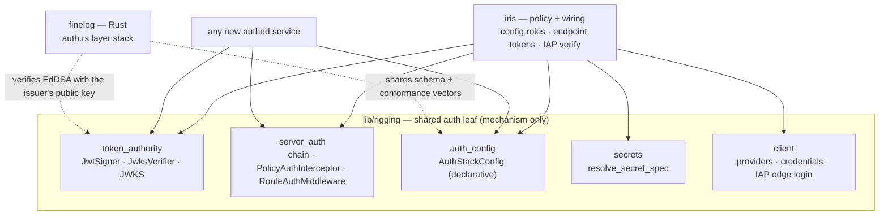
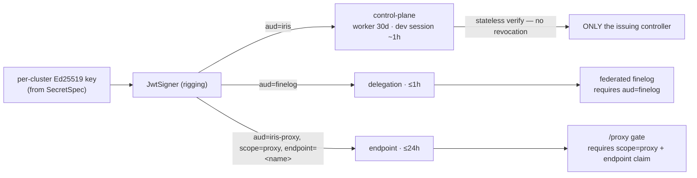
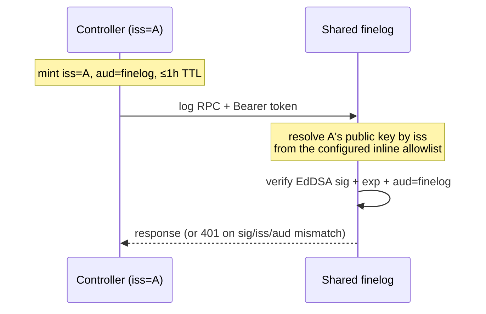
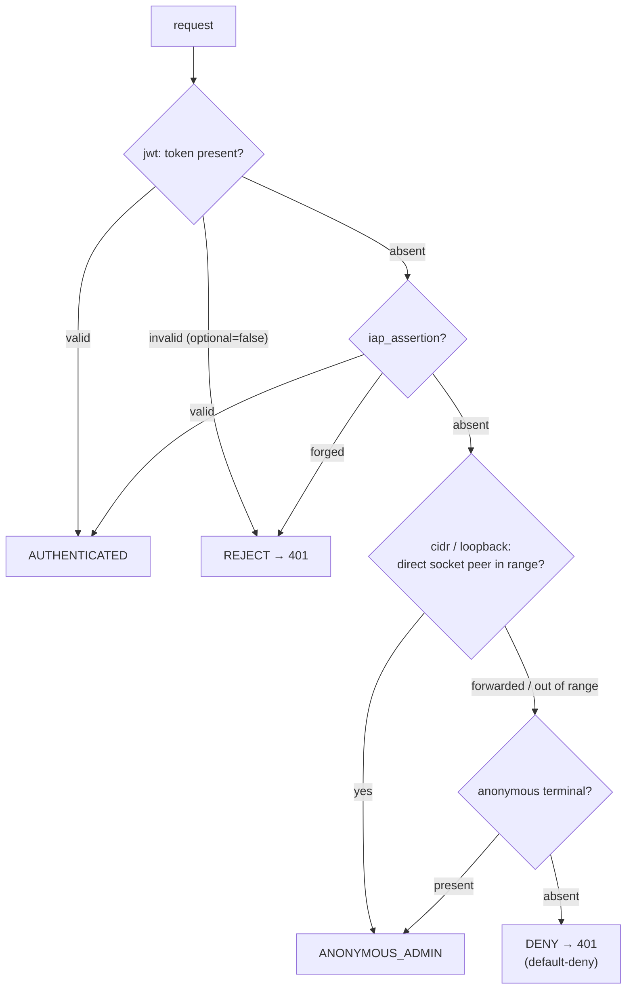
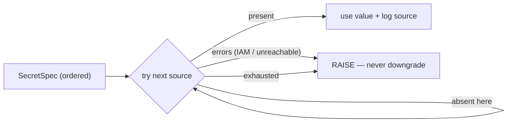

# Unified server auth & secret configuration

_Why are we doing this? What's the benefit?_

Server auth is already centralized in `lib/rigging` — verifiers, the
authenticator chain, and the two enforcement points a service mounts
unconditionally ([`server_auth.py`](https://github.com/marin-community/marin/blob/5a6f64cbeef5e1962ed367deb3aaf72956ddb4d1/lib/rigging/src/rigging/server_auth.py)).
The "sloppiness" the audit names is four gaps *around* that seam. This umbrella
picks one standard pattern for **defining a new authed service**, **where auth
config and keys live**, and **how services and clients authenticate** as one
posture. Because **no service tokens were deployed yet**, it also made the one
breaking change worth making: asymmetric keys.

**Issue status (as built).** #6861 (declarative schema) — done, the shared
`AuthStackConfig` + conformance vectors (§1). #6873 (plaintext secrets) — done,
`rigging/secrets.py` + the render guard (§2). #6580/#6592 (headless onboarding +
user tightening) — addressed by config-driven roles and pure-IAP user auth (§4),
**not** the originally-planned `SetUserRole` RPC / `iris user grant` / `users`-table
provisioning (spec §3, superseded). #6961 (shared-finelog controller-key
provisioning) — a documented placeholder, owned by a marin admin script (§5).

Full current-state map and external prior art: [`research.md`](./research.md);
contracts: [`spec.md`](./spec.md); headless onboarding + roles:
[`onboarding.md`](./onboarding.md).

## Overall shape

`rigging` is the single home for the auth *mechanism* — signer/verifier/JWKS,
the request chain, and client credential resolution. iris and finelog are
thin **policy + wiring** on top.

## Challenges

Auth is enforced by *two* implementations that mirror each other but drift:
rigging assembles its chain **in Python code** (`RequestAuthPolicy.enforcing`);
finelog parses a **declarative JSON layer stack** in Rust (`FINELOG_AUTH_POLICY`,
[`auth.rs`](https://github.com/marin-community/marin/blob/5a6f64cbeef5e1962ed367deb3aaf72956ddb4d1/lib/finelog/rust/src/server/auth.rs)),
with a different default posture (finelog default-deny; rigging installs
authenticators only when a verifier is present) and ordering (finelog cidr-first).
Second, iris **controller config** inlines shared secrets (`delegation_key`,
static tokens) into a world-readable ConfigMap / GCE metadata via `config_to_dict`
(#6873) — exactly the inlined-secret hazard this design's render guard
(`assert_no_inlined_secrets`) rejects.

## Costs / Risks

- Churn in a security-sensitive path with no user-visible feature; every
  regression is a potential auth bypass, so changes are test-gated behind the
  default-deny invariants.
- The token-format switch is cheap *now* (greenfield, ~3 sites) but breaking —
  do it before any token is issued, not after.
- Asymmetric keys add **key rotation** (JWKS overlap windows) as a real
  operational concern a single symmetric secret didn't have.
- A shared declarative schema adds a config surface + a cross-language conformance
  suite that must stay in lockstep.
- The Phase-2 Rust engine would give rigging a compiled wheel — deferred, gated.

## Design

### 0. Foundational: asymmetric, JWKS-verified tokens

Adopt **public-key JWTs (EdDSA/Ed25519)** now instead of HS256. The controller is a
**signing authority**: its one **per-cluster private key** is the cluster's server
identity, minting worker tokens, endpoint `/proxy` tokens, and finelog-relay
delegation tokens. It sources the key from a `SecretSpec` (§2 — never generated
into the node-local SQLite, which is lost on node replacement, `f691c03f2`) and
publishes public keys at `/.well-known/jwks.json`; every verifier holds only the
**public** key. A single marin-wide *private* key is rejected — it would recreate
the shared blast radius. The generic mechanism lives in `rigging.token_authority`;
iris keeps only policy.

**Persistence is a correctness requirement only for relay.** Worker and `/proxy`
tokens are self-verified by the issuing controller, so an ephemeral in-process key
is fine (a restart just re-auths workers and expires outstanding `/proxy`
share-links early). IAP user auth mints nothing (§4) and federation peers
authenticate as clients. The one token an *external* verifier pins to this
controller's published key is the finelog-relay delegation token (§5), so
`require_persistent_signing_key` fails fast — demanding a provisioned
`auth.signing_key` — only when `finelog.relay_address` is set. Every other cluster,
dev included, falls back to an ephemeral keypair when no key is configured.

**This retires #6873's headline secret:** `delegation_key` (a *shared symmetric
HMAC secret* finelog verifies with, that "anyone who reads can mint") becomes the
controller's **public** key — inline-safe, not a secret. `peers.static_token` and
`finelog.static_token` retire the same way. So finelog needs no inline-secret
guard at all (a jwt layer is inline-safe by construction), and the `SecretSpec`
residue shrinks to exactly two fields — the private signing key and the IAP OAuth
client secret (the static-token provider is gone entirely).

**MANDATORY corollary — per-plane audience binding (RFC 8725).** One key removes
the incidental isolation a *dedicated* symmetric key gave (a finelog-verifiable
token physically couldn't mint control-plane tokens). Without audience binding,
sig+exp-only verification would let any iris token verify at any federated
finelog, and let a compromised global finelog **replay** a delegation token at the
controller's RPC surface. So every token carries an `aud` naming exactly one
plane, and every verifier **requires** its expected `aud` (iris's control-plane
verifier is fixed to `{iris, iris-proxy}`; finelog to `{finelog}`).

**As built, verification is fully stateless** — pure crypto plus the `aud`↔scope
binding, with **no database read, no jti revocation list, and no session store**.
This is the biggest divergence from the original plan: there is nothing to revoke
remotely because there is nothing to revoke at all. Users hold no controller-minted
token — IAP authenticates each request and the role is resolved per request from the
verified assertion (§4) — so deprovisioning an IAP user is edit-config-and-reload,
effective on the next request, with no TTL to wait out. The one long-lived residual
is the shared worker machine token (`WORKER_TOKEN_TTL_SECONDS`, 30d), whose only
kill switch is rotating the cluster signing key; the only user session token
(`SESSION_TOKEN_TTL_SECONDS` ~1h) is the dev-only one `LocalCluster` mints for its
in-process auto-login. Remote verifiers (finelog) still only ever see short-TTL,
plane-scoped tokens.

**Federation — how a controller talks to a shared finelog.** Each controller is
its own issuer (`iss=<cluster>`, own keypair + JWKS). The one *built*
cross-service verify path is the finelog **delegation** token (§5): the controller
mints `iss=<cluster>, aud="finelog"`; a shared/global finelog verifies it against
**that controller's public key**, resolved by `iss` from finelog's *configured*
inline allowlist (never a URL from the token — SSRF), and requires `aud="finelog"`.
No shared secret; blast radius stays per-cluster.

The generic mechanism — `JwksVerifier` with a multi-issuer `iss → [public PEM]`
allowlist — lives in rigging and would equally back controller-to-controller
**peer** federation (a reserved `aud="iris-peer"` plane, which finelog already
rejects as a cross-plane replay in its conformance vectors). That peer plane is
**not yet minted**: today a controller reaches a peer over the ordinary rigging
client-credential path (`credentials_for`), so no `iris-peer` token is issued and
iris's own control-plane verifier trusts only its own issuer. (A marin **root**
signing cluster keys — a CA / SPIFFE trust domain — is the scaling step if cluster
count grows.)

The EdDSA service-token path is **one contract across languages**:
`rigging.token_authority` mints and verifies it in Python, and finelog verifies the
identical frozen token with `jsonwebtoken` in Rust (both bound by the shared
conformance vectors, §1). The IAP assertion (ES256) — the only non-EdDSA token the
controller verifies, since users mint nothing — verifies separately through
`google-auth`'s verifier.

### 1. One declarative auth-stack schema (#6861)

`rigging.auth_config.AuthStackConfig` — an ordered list of typed layers, parsed
from JSON/YAML, **deny-by-default**, that models the *request chain*
(`jwt` / `iap_assertion` / `cidr` / `loopback` / `anonymous`). There is no separate
login-exchange step: every request carries its own credential (a service JWT, an
IAP assertion, or a trusted network location), so the chain is the whole story.
`RequestAuthPolicy.from_config` compiles it into the authenticator chain, with a
state→stack table (spec §1.3) that pins each cluster's admit/deny outcome. The schema
shape follows Istio's `RequestAuthentication`/`AuthorizationPolicy` (research §7.1),
including the explicit CIDR proxy-trust model (socket-peer vs `X-Forwarded-For`).

What is *shared* with finelog is the ordered-list wire convention, the
default-deny/allow-localhost semantics, and the `cidr` layer. The drift fix is
the **Casbin lesson** (research §7.1): a **shared conformance test-vector suite**
both the Python and Rust evaluators must pass in CI — not two parsers that happen
to agree. The `jwt` layer stays per-implementation (rigging injects a Python
verifier; finelog's `JwtAuthLayer` carries an inline public key per §0).

### 2. Secret supply — `rigging/secrets.py` (#6873)

A secret field is a `SecretSpec`: an **ordered list of references**
(`env:` → `file:`; `gcp-secret://…/versions/<v>` always explicit, version
mandatory), resolved first-*present*-wins with an **absent-vs-failed** discipline
— the same `ABSENT`/`REJECT` rule the auth chain uses, so a stale source can't
silently shadow a rotated key.

A **default field-keyed path** (`env:` → `file:`) means the common case needs no
per-field config; it matches the platform-injection preference (research §7.2:
ESO/CSI populate `env:`/`file:` so the controller links no Secret-Manager SDK; only
GCE reads `gcp-secret://` via the attached SA). Resolution happens at the
**controller runtime** (not `load_config`, which also renders the deploy artifact);
fields carry an explicit `SecretRefSpec` marker (not the `is_sensitive_key_name`
name-heuristic, which misses `delegation_key`), and the two render sites call
`assert_no_inlined_secrets`, refusing a raw value anywhere in a path. No
`k8s-secret://` scheme (would need `secrets: get`, which the ClusterRole grants
none of). **Everything secret — including the private signing key — flows through
this one path.**

### 3. Consistent posture + the rollout runbook

Both iris and finelog express their request stack in the §1 schema (default-deny,
allow-localhost, `cidr` for direct-peer trust, `jwt`, IAP in front); finelog's
stale "ships no auth" note (`finelog/AGENTS.md`) is fixed. The one **still-pending
artifact** is a single page, `lib/rigging/docs/authed-service.md` (not yet written),
that would walk a service author through: mount `PolicyAuthInterceptor` + `RouteAuthMiddleware`
unconditionally; declare the stack; inject a verifier + role resolver; annotate
routes `@public`/`@requires_auth`; read `get_verified_identity()`; front with IAP
(`iap_gclb.py`) / Traefik (`install_traefik_proxy.py`) or expose at `/proxy/<name>`;
source secrets via `SecretSpec`. It calls out that a `cidr` layer grants
`ANONYMOUS_ADMIN` — operator-trust ranges only, never an ingress hop's. The
**client** recipe sits alongside: `credentials_for(cluster, auth)` →
`ClientCredentials.interceptors()` → `connect(transport, factory, auth=...)`.

### 4. Roles & headless onboarding (#6580, #6592) → [`onboarding.md`](./onboarding.md)

**Roles are config, not a table.** As built there is **no `users` table, no
`SetUserRole` RPC, and no `iris user grant` CLI** (the original plan, spec §3, was
superseded). Authorization is an in-memory `RolePolicy`
(`iris/cluster/controller/auth.py`) built from `AuthConfig` on controller start:
`role_for(user_id)` maps the worker machine identity (`system:worker`) to `worker`,
an `auth.admin_users` entry to `admin`, and everyone else to the default role — the
IAP `unprovisioned_role` on an iap cluster, `user` otherwise (cidr / null-auth).
Cluster config is the sole source of truth and is rebuilt on start; because an IAP
user holds no minted token and its role is resolved per request, deprovisioning is
edit-config-and-reload, effective on the next request.

**Pure IAP for users; the controller mints no user token.** IAP is the sole login
provider. The IAP GCLB validates an OIDC edge token at the edge and forwards a
cryptographically signed `X-Goog-IAP-JWT-Assertion` header. The controller's only
user-auth verifier is `IapAssertionVerifier` (built from `iap.signed_header_audience`,
which is **required** for an IAP cluster): it verifies that assertion (ES256) and
resolves the asserted email to a role through the `RolePolicy` — no controller token
is issued, so there is nothing to revoke. A browser reaches the controller through
IAP directly; CLI/CI callers present an IAP *edge* token (an OIDC ID token minted for
the desktop / programmatic client, validated by the GCLB) on each request.
`iris login` is a browser-only command: it runs the desktop OAuth flow and caches
only the IAP edge refresh token, from which each later RPC silently re-mints the
short-lived edge token — it does not exchange anything for a cluster token.

**Headless SA onboarding** (phase 1: attached-identity `generateIdToken` / a
time-gated SA key, keyless WIF as the documented fast-follow) mints the IAP edge
token a machine caller presents, and is detailed in [`onboarding.md`](./onboarding.md).
Its IAM half — granting `roles/iap.httpsResourceAccessor` — still stands; the
RPC/DB-provisioning half is replaced by the config edit above.

### 5. finelog federation (delegation tokens, #6961)

A cluster forwards its logs to a shared/global finelog by presenting a delegation
JWT: the controller mints `aud="finelog"`, `role="finelog-relay"`, ≤1h TTL
(`finelog_relay.py`), and the shared finelog verifies it against a **static inline
allowlist of controller public keys** in its `jwt` auth layer (Rust `auth.rs`:
`jsonwebtoken` EdDSA, `aud="finelog"` required). The public keys are inline-safe,
so no secret crosses the deploy boundary.

Populating that allowlist — deriving each controller's public key and writing it
into the shared finelog's config — is **cross-service orchestration that does not
belong in iris**: iris imports finelog and must not render finelog's deploy config.
It is a top-level marin admin-script concern, tracked in **#6961**. The finelog
deploy configs carry a commented placeholder for that `jwt` layer until the script
lands; a null-auth cluster instead reaches a same-VPC/loopback finelog through a
`cidr` layer with no token.

### 6. Endpoint tokens & the `/proxy` gate (#6857)

A registered task endpoint (a dashboard, an inference server) is reached at
`/proxy/<name>/…` on the controller host. Some endpoints must be shareable with
someone who holds no cluster identity — a link pasted into a doc, an iframe — without
handing out a full credential. The same one signing key that mints control-plane and
delegation tokens (§0) mints a third, deliberately weak plane for exactly this: a
scoped, expiring endpoint token.

**One key, three planes, told apart only by `aud`.** `JwtTokenManager`
(`iris/cluster/controller/auth.py`) mints `aud="iris"` for control-plane user/worker
tokens (full authority per role), `aud="finelog"` for relay delegation (§5), and
`aud="iris-proxy"` for endpoint tokens. `create_endpoint_token` mints the last with
claims `{scope:"proxy", endpoint:<wire-name>, role:"endpoint"}` and a TTL defaulting
to `DEFAULT_ENDPOINT_TOKEN_TTL_SECONDS` (3600s), capped at
`MAX_ENDPOINT_TOKEN_TTL_SECONDS` (86400s). The `endpoint` role carries **zero RPC
authority** — the RPC authorizer denies any audience-bearing identity — so the token
does nothing but pass one endpoint's `/proxy` gate.

**The cross-plane replay guard is the `aud`↔`scope` binding.** The control-plane
verifier's `expected_audiences` is the fixed `{"iris", "iris-proxy"}`, so a `finelog`
(or reserved `iris-peer`) token replayed at the RPC surface is rejected before any
policy runs. Within that set, `verify()` binds `aud` to `scope`: an `iris-proxy`
token must carry `scope="proxy"` and an `endpoint` claim, and only then surfaces as
its bound endpoint (never as a full identity); a control `iris` token must **not**
carry a proxy scope. Either mismatch raises — otherwise an `iris-proxy` token missing
its scope would surface as a full identity, a latent authz-escalation footgun.

**The `/proxy` gate is keyed on the endpoint's access mode** (`_authorize_proxy`,
`dashboard.py` — the *only* place a scoped token is accepted):

- `PUBLIC` — open, no auth at all.
- `BEARER` — a scoped proxy JWT whose `endpoint` claim matches **this** endpoint's
  wire name, or a full cluster identity, passes; a scoped token for another endpoint
  is rejected.
- `PRIVATE` (and any unknown name) — a full cluster identity is required; a scoped
  token is rejected outright.

The credential reaches the gate two ways, resolving to the same scoped JWT: the
`Authorization` header, or embedded in the URL path as `/proxy/t/<token>/<name>/…`
for shareable links and iframes where a header can't be set.

**The IAP-whitelist rule follows directly.** A `/proxy` route may be whitelisted past
IAP — reachable with no `X-Goog-IAP-JWT-Assertion` stamp — **only** for `PUBLIC` and
`BEARER` endpoints, where the controller is the sole gate (open, or a matching scoped
JWT it verifies itself). A `PRIVATE` endpoint requires a full identity (an IAP
assertion or a control token) and must **not** be IAP-whitelisted, or IAP's edge check
would be the only thing standing between the internet and a private dashboard, and the
whitelist would remove it.

These endpoint tokens are on purpose scoped, expiring JWTs minted off the one signing
key — **not** a separate shared secret and **not** a bare HMAC or opaque nonce. That
keeps them under the same trust root, the same JWKS rotation, and the same
self-describing claims (`aud`/`scope`/`endpoint`/`exp`) as every other token, so the
gate reasons about them with the same verifier rather than a bespoke side channel.

## Phasing & the Rust engine

- **Phase 1 (built):** the token switch (§0) + declarative schema + conformance
  vectors + `secrets.py`, plus config-driven roles (§4) and pure-IAP user auth. All
  landed; no packaging change. Where the build diverged from the plan is recorded
  inline above: verification is stateless (no jti store, no `api_keys` table, no
  `users` table, no `SetUserRole` RPC / `iris user grant` CLI); the controller mints
  no user token, so the shared worker token is the one 30-day residual and the ~1h
  session token is dev-only; the static-token provider and `StaticAuthConfig` arm
  are gone, and so is the whole `gcp` login provider (`AuthConfig` selects only
  `iap`, plus cidr/null-auth); and populating a shared finelog's public-key allowlist
  is deferred to a marin admin script (#6961).
- **Phase 2 (not built, still gated): a shared Rust *verify* engine.** Server-side
  verification is standard JWT crypto — the IAP assertion (ES256) and EdDSA service
  tokens verify with `jsonwebtoken` + a JWKS cache, and finelog **already** verifies
  in Rust and **already ships a pyo3/abi3 wheel** (`lib/finelog/rust/pyext/`). So the
  engine generalizes `auth.rs` + ports the pure layers of `server_auth.py` behind an
  existing packaging pattern; it returns verified claims and Python assigns the role
  (the in-memory config `RolePolicy` resolves email→role — a Python callback, no DB).
  **Client-side minting stays Python and *standard*** (WIF for headless, installed-app
  OAuth for humans — both minting the IAP *edge* token, not a cluster token) — there
  is no bespoke Rust re-mint to write. **Recommend building Phase 2 only if the
  conformance vectors surface real semantic drift**; if built, verify-only.

## Testing

The **shared conformance vectors** (input request → expected verdict) run against
both evaluators — the drift gate. `resolve_secret_spec` per scheme, covering
absent-vs-failed and unknown-scheme-raises. `RequestAuthPolicy` round-trip tests
that every state→stack entry (spec §1.3) admits/denies identically to today's
chains (re-running `test_server_auth.py`: loopback, `X-Forwarded-For` spoof,
worker-JWT attribution, scoped-token RPC denial). The load-bearing #6873 test is a
**deploy-path round trip**: a reference-configured cluster renders the *reference*
(never the value) and passes `assert_no_inlined_secrets`, a raw secret raises, and
`serve` resolves at startup. Add EdDSA verify + **per-plane `aud` rejection** tests
(a control-plane token must be rejected by finelog; a delegation token by the RPC
surface). Rollout: exercised against the Iris dev controller before marin.

## Resolved decisions & remaining options

Decisions the build settled:

- **Signature algorithm: EdDSA (Ed25519), chosen and shipped.** PyJWT
  (`cryptography`) mints/verifies; finelog's Rust `jsonwebtoken` verifies the same
  frozen contract. ES256 was the alternative if a future non-Rust/non-Python
  verifier mattered — not needed.
- **No symmetric bearer survives on the verify path.** `delegation_key`,
  `finelog.static_token`, and `peers.static_token` are removed; the static-token
  login provider and the `StaticAuthConfig` arm are gone entirely, and so is the
  `gcp` login provider (`AuthConfig` selects only `iap`, plus cidr/null-auth). The
  only client-side static primitive left is rigging's `StaticTokenProvider`, no
  longer wired into an iris login arm.
- **No token revocation, no `users` table, no role-grant RPC.** Verification is
  stateless; roles come from the in-memory config `RolePolicy` (§4). An IAP user
  holds no minted token, so deprovisioning is a config edit + reload, effective on
  the next request.
- **`SecretSpec` default path kept** (`env:` → `file:`; `gcp-secret://` always
  explicit since its version can't be conventional): a field with no explicit
  reference resolves via `default_secret_spec`.

Still genuinely open / deferred:

- **Biscuit — optional, attenuation-only, separate.** With asymmetric native, its
  only residual win is offline *attenuation* of scoped `/proxy` tokens (self-mint).
  It replaces the `jwt` layer, not the stack. Skipped for the core; evaluate
  separately only if offline capability-attenuation is wanted.
- **Phase-2 Rust *verify* engine — gated on drift.** Not built; verify-only if
  built, mint stays Python.
- **Worker-token hardening.** The 30-day shared worker token
  (`WORKER_TOKEN_TTL_SECONDS`) is a known residual: its only kill switch is signing-
  key rotation. Per-worker short-lived tokens (or a worker-credential rotation lever)
  are a tracked follow-up.
- **Out of scope (confirming):** unauthenticated bundle downloads (deferred in
  `20260312_iris_auth_design.md`) and session-JWT refresh stay out — flag if you
  disagree.
