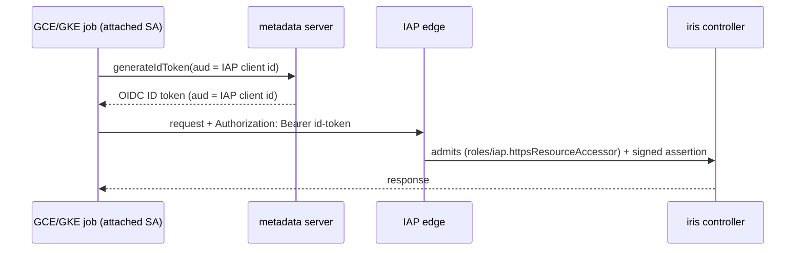
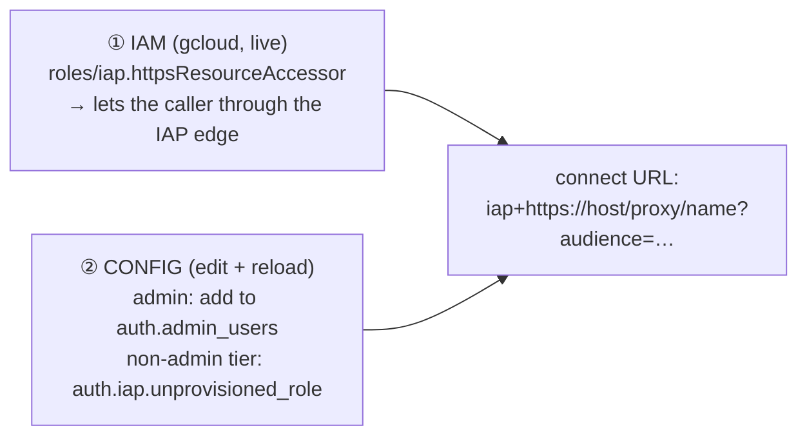

# Headless onboarding & user tightening (#6580, #6592)

A nearly-independent slice of the [auth umbrella](./design.md): how a headless
identity (CI, cron, ops script) reaches an IAP-fronted Marin service without a
downloaded key, and how authorization stops auto-granting write access on first
login. **As built, roles are a config-driven, in-memory policy** — there is no
`users` table and no role-grant RPC (the [`spec.md`](./spec.md) §3 plan is
superseded); this doc reconciles the onboarding steps to that. Current-state map:
[`research.md`](./research.md) §2, §7.2 (WIF).

## Problem

Two loose ends around IAP:

- **#6580 — no clean headless auth.** The service-account→IAP flow is fully
  implemented (`IapServiceAccountTokenProvider`), but standing up a CI/cron
  identity is tribal, spread across GCP IAM + cluster config + the controller user
  store — so jobs (e.g. the cost-manager, PR #6555) fall back to an SSH tunnel with
  an extra SSH-key secret.
- **#6592 — authorization wasn't an allowlist.** Historically the `login` RPC
  auto-provisioned *any* IAP-admitted identity at the write-capable default role
  `"user"`, so "who can reach IAP" was the only real gate. The fix (below) makes the
  cluster config the allowlist.

## #6580 — headless access (phase 1: SA credentials, no WIF yet)

The existing `IapServiceAccountTokenProvider` already turns an SA identity into an
IAP ID token; the only real question is **how the SA credential is sourced**.
Full Workload Identity Federation (keyless, no downloaded key) is the right
*end-state*, but standing up pools + providers + a chain of IAM bindings is
over-built for the first cut. **Phase 1** therefore ships the two simplest safe
paths and keeps WIF as a documented fast-follow:

- **Attached identity (GCE/GKE cron) — no key at all.** The attached SA calls
  `generateIdToken(audience=<IAP client id>)` off the metadata server. This is the
  default wherever a workload identity already exists; nothing is downloaded.

- **Keyless environments (GitHub CI) — a time-gated SA key.** Where no GCP
  identity exists, use a downloaded `iap-caller` SA key, but **sourced through the
  same `SecretSpec` path** (§2) so it is never inlined, and **time-gated**: enforce
  key expiry/rotation via the `iam.serviceAccountKeyExpiryHours` org policy so a
  leaked key self-expires. This trades WIF's setup cost for a rotation obligation —
  acceptable for phase 1.

**WIF is the end-state, not phase 1.** When CI-identity federation is worth the
setup, the keyless upgrade (CI OIDC → WIF → impersonate `iap-caller` →
`generateIdToken`) drops the downloaded key entirely and retires the rotation
obligation. Tracked as a fast-follow; not built in this PR.

## #6592 — config is the allowlist

As built, authorization is an in-memory `RolePolicy` derived from `AuthConfig` at
controller start: `auth.admin_users` → `admin`, the worker machine identity →
`worker`, everyone else → the default role. On an **IAP cluster** that default is
`IapAuthConfig.unprovisioned_role` (read-only `dashboard`), so a freshly-admitted
IAP identity is read-only — the config, not "reached IAP", is the write-access
allowlist. `login` verifies the presented identity token, rejects a reserved
`system:` subject, and mints a session token carrying that **config-resolved** role
(never the incoming token's). `gcp` login is unchanged (there
`GcpAccessTokenVerifier`'s project check already *is* the allowlist). There is **no
`SetUserRole` RPC and no `users` table** — the planned role-grant path was dropped.

## Granting a role — config edit + IAM binding

There is no `iris user grant` command. Onboarding a human or SA is two manual
planes:

1. **[IAM] reach IAP** — bind `roles/iap.httpsResourceAccessor` on the IAP backend
   for the identity (`gcloud iap web add-iam-policy-binding …`). This is what lets a
   caller through the IAP edge at all; unchanged from the plan. A read-only
   (`dashboard`) grant needs only this plane, since that is the IAP default.
2. **[CONFIG] set the role** — elevate to `admin` by adding the identity's email/SA
   to `auth.admin_users`; the non-admin tier is the cluster-wide
   `auth.iap.unprovisioned_role` (`dashboard`/`user`/`admin`). Either is a config
   edit that takes effect on **reload** (a controller restart rebuilds the
   `RolePolicy`); there is no live mutation of a running controller.

In phase 1 a headless SA is onboarded exactly like a human (the IAM binding, plus a
config entry only if it needs admin); the WIF binding orchestration lands with the
keyless upgrade.

**Claims trap (runbook note):** the role is baked into the (~1h session) JWT and
verification never reads any store, so a config change takes effect only after the
user re-runs `iris login` (or their current token ages out within the session TTL).

## Rollout note

The default-role flip is a behavior change for every IAP cluster (previously first
login granted write). Because roles are config, operators pre-grant current write
users — list the admins in `auth.admin_users`, and set `auth.iap.unprovisioned_role`
to the intended non-admin tier — before the flip is deployed; there is no live
migration step. (The rest of the open questions are in [`design.md`](./design.md).)
