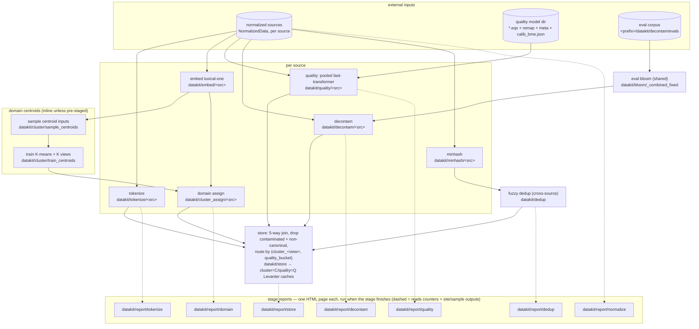

# Datakit reference pipeline

End-to-end DAG from normalized Datakit sources to the per-(cluster, quality)
Levanter store. [`reference_pipeline.py`](reference_pipeline.py) builds the
StepSpec graph and runs it as a single iris job, in one of two modes:

- `--mode full`: sources from `marin.datakit.sources.all_sources`, K=5000.
- `--mode sample`: a pre-built testbed sample registered as already-normalized
  sources (`--sample-prefix`), K=64 — a true end-to-end run on real data.

All worker CPU/RAM is one `PoolConfig` (`n_workers` x `worker`, overridable with
`--pool-workers/--pool-cpu/--pool-ram`) shared across the stages. Each stage runs
its pipeline on its own dedicated Zephyr coordinator + worker fleet (vanilla
`ZephyrContext`), sized by that config; `--max-concurrent` bounds how many stages
the StepRunner walks at once.

Every stage keeps one step per source with its own output dir
(`datakit/<stage>/<source>_<hash>/`); only dedup and the store combine sources,
by design. Steps write their main output under `outputs/main/` plus, where it
makes sense, a small site/sample side output (`outputs/samples/`,
`outputs/flagged_sample/`, …) that the per-stage HTML reports
([`reports/`](reports/)) read.

Each `datakit/report/<stage>` step depends only on that stage's steps, so it
runs as soon as the stage finishes — reports are not deferred to the end of the
run, and only `report/store` waits on the store. They are separate steps (not
folded into the data steps) so a report can be regenerated without recomputing
the stage. Embed and minhash have no standalone report.

## Layout

| Path | What it is |
| --- | --- |
| `reference_pipeline.py` | The DAG builder + CLI (`--mode full\|sample`, `--pool-*`, `--sources`, `--quality-model`) |
| `cluster/quality/fast_transformer/` | Quality classifier: per-source scoring step + training/calibration |
| `cluster/domain/v0/` | Domain clustering: centroid sampling/training + per-source assignment |
| `embeddings/luxical/` | Luxical-one document embeddings feeding the domain stage |
| `decontam/` | Eval-corpus preparation (the decon step itself lives in `marin.datakit.decon`) |
| `store/datakit_store.py` | 5-way join → per-(cluster, quality) Levanter caches |
| `reports/` | Per-stage single-page HTML reports (`common.py` + one module/template per stage) |
| `testbed/` | Sampled-corpus testbed used by the smoke and decon experiments |

## Running

Submission commands (full and sample mode) live in the `reference_pipeline.py`
module docstring.
