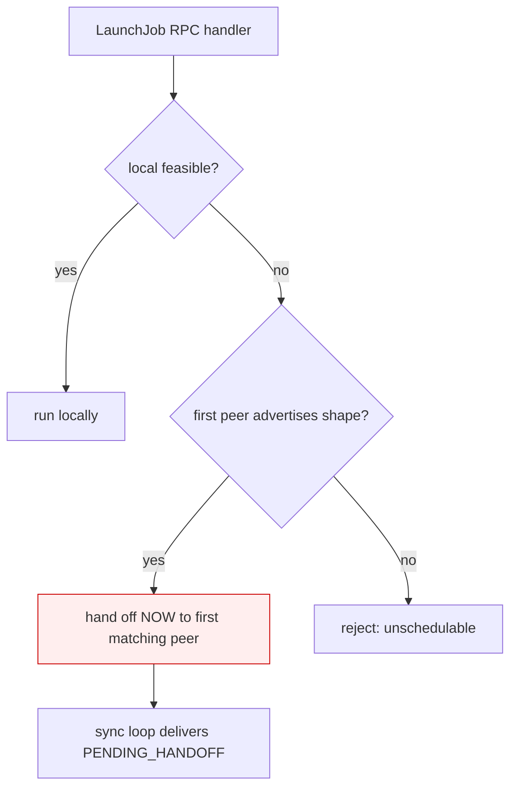
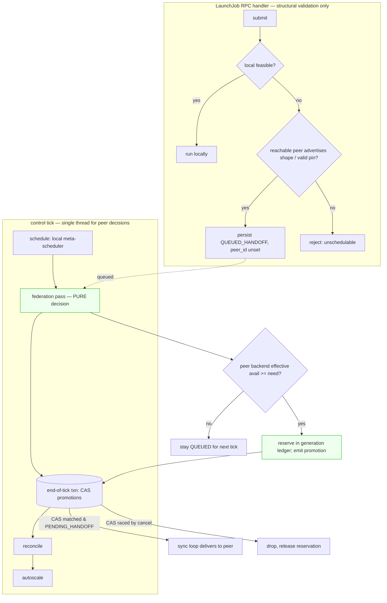
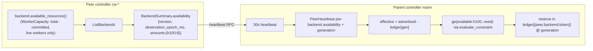

# Cluster queueing and federated availability

Status: **proposal, rev 3** — design for review (issue
[#7099](https://github.com/marin-community/marin/issues/7099)). Rev 3 folds in a
codex peer-review (see *Concurrency & correctness* and *Compatibility*).

## Problem

The Iris federation layer lets a user submit every job to one parent cluster
(`marin`) which hands GPU work off to CoreWeave peers (`cw-rno2a`,
`cw-us-east-02a`). Today the parent picks a peer **once, synchronously, at
submit time**, in the `LaunchJob` RPC handler:

`PeerRouter.decide` (`cluster/federation/router.py`) chooses, in order:

1. an explicit `cluster=<peer>` pin, else
2. **local** if any local backend is feasible for the job's shape, else
3. the **first peer** (by peer id, ascending) whose last capability heartbeat
   advertises a backend that satisfies the job's routing constraints, else
4. local, so the caller fails it as unschedulable rather than wedging.

Step 3 matches only the job's **shape** — `device-type`, `device-variant`,
`region`, `zone` (`routing_constraints`). It never looks at how much of that
shape is **free right now**. `_peer_can_host` (`router.py:86`) returns `True`
as soon as a peer advertises an `H100` backend, regardless of whether every
H100 on that peer is already busy.

So with two same-shape H100 peers, **every** GPU job routes to the
lexicographically-first peer (`cw-rno2a`) and queues there, idle, while
`cw-us-east-02a` sits empty. The issue asks us to instead **hold jobs in a
controller-side queue until a peer reports available capacity**, then spread
them across peers by availability.

@rjpower's framing: *"we'll have a controller-side queue. Thread this elegantly
so that ideally we have a clean single thread of control for all controller
scheduling decisions."*

### Why this is really two problems

1. **No availability signal.** A peer advertises *what shapes it has*, not *how
   much is free*. Peers must surface a free-capacity metric.
2. **The peer decision is in the wrong place.** Federation is decided on the RPC
   handler thread at submit, decoupled from the control tick where every other
   scheduling decision is made. A queue that waits for a *changing* signal
   (peer availability, refreshed every 30 s) belongs on the **periodic control
   tick**, not the one-shot submit path.

## Scope decision (rev 3)

We move **all peer scheduling decisions onto the control tick** — peer
selection, the availability gate, queue→assign promotion, and per-tick
re-evaluation of queued jobs. We **keep** submit's cheap structural gate: request
validation, pin validity, root-only federation, auth, and the existing
*static* local-feasibility check (`job_feasibility` is over configured groups,
which do not change at runtime, so nothing is gained by deferring it). A job that
is not locally feasible and that **no currently-reachable peer advertises the
shape for** is still rejected synchronously — exactly today's behavior, so no
UX regression. The new behavior is entirely *among reachable, shape-matching
peers*: instead of dumping on the first, the job **queues** and the tick assigns
it to a peer that has room.

Precise claim: **peer selection, availability gating, and the federation queue
live on the single control tick.** Submit does structural validation only; it
never selects a peer or a moment. We do not claim local-vs-federation
reclassification on the tick (local feasibility is static config, so it cannot
change under a running controller).

## Existing work we build on

This design is the **federation-scoped analogue of two mechanisms that already
exist for local scheduling**; we reuse their vocabulary and machinery.

### Reservations → `availability:<variant>` constraints

Reservations (a synthetic holder job that pinned capacity) were **removed** in
migration `0029_drop_reservations.py`. `--reserve` now lowers to a hard
`availability:<variant>` **scheduling constraint** (`cli/job.py::_reserve_constraint`
→ `constraints.availability_constraint`), an `EXISTS` marker
(`constraints.py:346`). The scheduler folds each worker's **empirically-confirmed**
zone capabilities onto the worker as `availability:<variant> = true`
(`scheduling/policy.py::enrich_workers_with_availability`), computed by
`autoscaler/routing.py::empirical_zone_capabilities` (a variant counts for a
region once a group there has `>0` READY slices and is not quota-blocked).

> **Semantics disambiguation (per review).** `availability:<variant>` means
> *"this accelerator has been empirically **obtained** in this region"* — a
> feasibility/provisionability signal, **not** idle capacity. Our new metric is
> different: *"how many chips are **free right now**"*. To keep the two from
> being confused operationally we name the numeric key **`available:<token>`**
> (matching the issue's `ge("available:h100", N*8)`) and always spell out that
> `available:` (numeric, free-now) ≠ `availability:` (boolean, obtainable). The
> parallel we draw is only structural: boolean `EXISTS` → numeric `GE amount`.

### Backend / scaling-group availability attributes

- A backend advertises static routing attributes via
  `advertised_attributes()` (`controller/backend.py:480`), surfaced on
  `BackendSummary.advertised_attributes` by `ListBackends` (`service.py:3086`)
  and carried across the peer boundary by the 30 s capability heartbeat
  (`federation/peer.py::probe` → `PeerHeartbeat.backends`).
- Free capacity *within* a peer is already computed for local scheduling:
  `WorkerCapacity.from_worker` (`scheduling/scheduler.py:223`) derives
  `available_gpus = total_gpu_count − committed_gpu_count` per worker; TPU slices
  track READY state. **The number that answers `available:h100` already exists
  on each peer — it is simply not advertised.**

## Design

Three pieces, each mapping onto an existing seam.

### 1. Peers advertise available resource amounts (generic, versioned)

Extend the capability heartbeat so each **backend** surfaces how much of each
consumable resource is free right now — a generic `resource → amount` map, not a
hard-coded accelerator field, so the same channel later serves other consumables
without a proto change.

> **proto3 gotcha (per review): an omitted map and an empty map are
> indistinguishable.** We therefore wrap the map in a *message* so "old peer that
> never set it" is distinguishable from "new peer reporting an authoritative
> zero":

```proto
message ResourceAvailability {
  uint32 version = 1;              // metric-semantics version; unknown => treat as unknown
  int64 observation_epoch_ms = 2;  // when the peer computed this; the heartbeat GENERATION
  map<string, int64> amounts = 3;  // free amount per resource token ("h100", "v5p-8")
}
message BackendSummary {
  ...
  ResourceAvailability availability = 15;  // UNSET => legacy peer, shape-only fallback
}
```

- **Field unset** → legacy peer; the parent falls back to today's shape-only
  eligibility for that backend (see *Compatibility*).
- **Field set, `amounts` empty** → authoritative "nothing free right now."
- `observation_epoch_ms` is the **generation** the parent's reservation ledger
  keys on (§ *Concurrency*).

**Per-backend, never summed across backends.** A job pins to exactly one backend
(`meta_scheduler.route_jobs_to_backends`), so shape **and** availability are
always evaluated against the **same** `BackendSummary`. A peer with 4 free H100s
on backend A and 4 on backend B does **not** advertise 8 usable for an 8-GPU
task. The parent picks a `(peer, backend)` candidate and rolls the winner up to
the peer; it never adds a token across backends.

**Units per token.** GPUs pack, so `available:h100` counts free **chips**;
TPU VMs are atomic, so `available:v5p-8` counts free **slices**. The job side
derives the matching unit.

**Free-now, not configured.** Including configured capacity would re-create the
pile-on (every job sees room). "Free now" is the signal that makes jobs wait for
and spread to real idle capacity (mirroring `empirical_zone_capabilities`
preferring live READY slices).

**Computed from the scheduler's own capacity view, not ad hoc in the handler.**
Per review, `ListBackends` must not reconstruct scheduling state. We add a
backend method `available_resources() -> dict[str, int] | None` implemented by the
placement-owning backend from the **same worker-source / `WorkerCapacity`** logic
the scheduler uses (only schedulable/live workers; committed-but-not-yet-running
assignments already subtracted, since `committed_gpu_count` counts unfinished
worker-bound attempts). `ListBackends` serializes that result; `None` leaves the
field **unset**.

**CoreWeave GPU peers run on Kubernetes (rev 4).** Kueue — not Iris — owns
placement there, so a k8s (`CLUSTER_VIEW`) backend has no per-worker Iris capacity
view. Instead it infers a **best-effort** free-GPU count from the node/pod state it
already caches each periodic kubectl sync (`ClusterState.free_gpus`: total
`nvidia.com/gpu` allocatable across nodes minus what non-terminal pods request —
no extra kubectl call), and attributes it to the backend's advertised GPU
`device-variant`. Only when the backend advertises exactly one GPU variant is the
attribution unambiguous; otherwise it returns `None` (shape-only). This is
deliberately imprecise — it lags the sync and ignores per-node packing — which the
meta-scheduler tolerates by design; the peer's own Kueue is the backstop. Without
this, the primary GPU peers would advertise no availability and the queue would
never drain to them.

**Accelerator-only first cut.** The wire format is generic, but v1 emits only
accelerator tokens. CPU/memory are deliberately excluded until their
fungibility, oversubscription, and units justify the added semantics.

### 2. Availability translation reuses the constraint machinery (generic GE gate)

A federation candidate's request decomposes into required `{token → amount}`
(`8×H100` over `N` replicas → `{"h100": N*8}`, in the token's unit). Each becomes
an `available:<token> ≥ amount` gate as an ordinary `ge` **`Constraint`**, via an
`available_key(token)` helper — the numeric parallel of the existing
`availability_key`:

```python
AVAILABLE_PREFIX = "available:"
def available_key(token: str) -> str:
    return f"{AVAILABLE_PREFIX}{token.strip().lower()}"          # "available:h100"

def peer_availability_gate(request) -> list[Constraint]:
    # {"h100": N*8} -> [Constraint(key="available:h100", op=GE, value=N*8)]
    return [Constraint.create(key=available_key(tok), op=ConstraintOp.GE, value=amt)
            for tok, amt in required_resource_amounts(request).items()]
```

We evaluate each gate against a `(peer, backend)` candidate's *effective*
availability (advertised minus this-generation reservations) with the **existing**
`evaluate_constraint` (`constraints.py:927`, which already implements `GE` via
`_compare_ordered`). Integer typing is preserved on both sides so the compare is
numeric, not lexical.

> **We do NOT rebuild a `ConstraintIndex` for this (per review).** The index pays
> off for many jobs × set-valued static attributes. Federation has a handful of
> peers, volatile *scalar* availability, and must **mutate** availability after
> each assignment. A direct loop is clearer and avoids rebuilding an index after
> every decrement:
> ```python
> for candidate in (peer, backend) candidates:      # shape already matched
>     if all(evaluate_constraint(candidate.effective.get(c.key), c) for c in gate):
>         assign; candidate.decrement(gate)          # mutate the per-generation ledger
> ```

### 3. Controller-side queue + a federation pass on the single control tick

**A peer is a backend at cluster granularity.** The local meta-scheduler routes
unpinned jobs to local backends by shape; the new federation pass routes queued
candidates to peers by shape **and** availability. The extra availability gate is
the one thing a local backend does not need — locally the autoscaler *provisions*
capacity, so a job waits in place; a peer we cannot autoscale, so we wait for its
capacity to *free up*. That asymmetry is why peers queue and local backends do
not.

#### At submit (RPC handler) — record intent, never pick a peer

`service.launch_job` stops calling `route_submit` + `_hand_off_job`. It
classifies once:

- **Local** if locally feasible (unchanged).
- **Queued federation candidate** if not locally feasible and a currently-reachable
  peer advertises the shape (or a `cluster=<peer>` pin names a reachable peer that
  does): persist a `federated_jobs` handle in a new **`QUEUED_HANDOFF`** state with
  `peer_id = ""` (unpinned) or the pinned peer. No peer chosen, nothing delivered.
- **Rejected fast** if not locally feasible and no reachable peer advertises the
  shape — status quo.

> **Rejection semantics shift (per review).** Peer *allowlist* rejection can only
> be discovered at delivery. Under queueing, submit returns success and a
> permission/malformed rejection surfaces later as a failed job (the manager
> already terminalizes `HANDOFF_REJECTED`). Everything checkable locally stays
> synchronous. This is documented in `docs/federation.md`.

#### On each control tick — a `federation` phase after the schedule phase

A new phase in `_control_tick`, in the single scheduling thread, after
`_schedule_phase` and before the commit:

```text
schedule (local meta-scheduler + per-backend placement)
  → federation  ← NEW: assign queued candidates to peers by availability (PURE decision)
  → reconcile
  → autoscale
  → one end-of-tick write transaction  ← promotions committed here, conditionally
```

`FederationManager.assign_queued(candidates, peer_availability, ledger, cap)` is a
**pure function over a snapshot** returning `(job_id, peer_id)` promotions:

1. Read `QUEUED_HANDOFF` candidates (priority-band, then submit age).
2. Snapshot each reachable peer's per-backend advertised availability and its
   `observation_epoch_ms` (generation).
3. Compute **effective** availability = advertised − reservations already made
   from *this generation* (the ledger, § *Concurrency*).
4. For each candidate, in order, **fit-aware** (a job that does not fit is
   skipped, not head-of-line-blocking), pick a `(peer, backend)` whose shape +
   `ge` gate + pin are satisfied by effective availability. Tie-break: **best-fit**
   remaining accelerator capacity for the gated token, then peer id.
5. On a match, **reserve** in the ledger (decrement effective) so no later
   candidate in this or a following tick (same generation) double-books it.
6. Safety cap of `max_federation_handoffs_per_cycle` per peer per tick on top of
   the ledger.

The commit applies each promotion as a **conditional CAS** (§ *Concurrency*); the
ledger reservation is confirmed only for promotions whose CAS actually flipped a
row. Delivery is unchanged: the 3 s sync loop re-drives `PENDING_HANDOFF` handles
(`manager._redrive_pending_handoffs → _deliver_handoff → peer LaunchJob`). The
tick makes the *decision*; the manager does the *delivery I/O* off-tick.

## Concurrency & correctness (rev 3, the crux of the review)

The controller is **not** single-writer: RPC cancellation, handoff-delivery acks,
and sync application all write concurrently with the tick. Correctness rests on
**state-conditional writes + a generation-keyed reservation ledger**, not on a
single-thread assumption.

### Bounding over-assignment across ticks — generation + reservation ledger

The naive "decrement an in-tick copy" does **not** bound assignments: the
decrement evaporates at end-of-tick, and the schedule phase runs on submit wakes
far more often than the 30 s heartbeat, so every tick re-reads the same
advertised number and could promote the whole queue against one stale
observation.

Fix: an in-memory ledger `reserved[(peer, backend, token)] -> amount`, tagged with
the backend's `observation_epoch_ms` **generation**. `effective = advertised −
reserved`. The ledger is **reset for a `(peer, backend)` only when a strictly
newer generation arrives** on the heartbeat. So across ticks between heartbeats,
reservations accumulate and effective availability monotonically decreases —
a peer that advertised 8 free H100s yields at most 8 chips of promotions until its
next heartbeat, regardless of tick cadence. We **reserve at promotion**
(`PENDING_HANDOFF`), because a promoted job has consumed the parent's routing
budget whether or not the peer has acked yet. When a newer heartbeat arrives its
number already reflects the delivered jobs, so resetting the ledger to the fresh
generation is correct.

The ledger is a controller-side hint, not a source of truth; if it is lost on
restart the worst case is a burst of re-assignment bounded by the next heartbeat —
the issue explicitly tolerates this.

### Promotion cannot race cancellation/terminalization — conditional CAS

`assign_queued` decides on a (possibly stale) snapshot. Between snapshot and
commit a user may cancel, or the job may terminalize. Promotion is therefore a
**compare-and-set inside the tick's commit transaction**, via a new `writes`
helper (not the unconditional `set_handoff_state`):

```sql
UPDATE federated_jobs
   SET handoff_state = PENDING_HANDOFF, peer_id = :peer
 WHERE job_id = :job
   AND handoff_state = QUEUED_HANDOFF
   AND cancel_intent_version = 0
   AND EXISTS (SELECT 1 FROM jobs                        -- still nonterminal
               WHERE jobs.job_id = :job AND jobs.state NOT IN (terminal))
```

The **affected-row count decides** whether the promotion (and its ledger
reservation) actually took. A promotion whose CAS matched zero rows was raced by a
cancel/terminalize; we drop it and release its reservation.

### Queued cancellation

Extend `bump_cancel_intent` so a `QUEUED_HANDOFF` handle (like `PENDING_HANDOFF`)
is **terminalized locally** and **never** issues `TerminateJob` — its `peer_id` is
empty, and nothing was ever delivered. The CAS above then guarantees a racing
promotion cannot resurrect it.

### Transaction boundary

`assign_queued` opens **no** transaction. It consumes the tick's read snapshot +
the in-memory ledger + peer heartbeats and returns pure decisions. `_commit_tick`
applies the CAS promotions with controller-owned `reads`/`writes` on its existing
`Tx`, alongside every other scheduling effect. Background federation ops
(`ControllerFederationStore`) keep owning their own transactions; the tick never
calls a store method that opens a nested/separate one.

### Terminal-unschedulable / wedge avoidance for queued jobs

Each tick re-evaluates queued jobs against current peer availability, so a job
naturally waits out a temporarily-full or briefly-unreachable peer. A queued job
does **not** wait forever, though: a queued handoff owns no task rows, so the
task-level scheduling-timeout scan never sees it, and without special handling a
job submitted with a `scheduling_timeout` would sit in `QUEUED_HANDOFF` past its
deadline. So the tick runs its own expiry pass — `reads.expired_queued_handoffs`
returns nonterminal queued jobs whose stored `scheduling_deadline_epoch_ms` has
elapsed, and `_commit_tick` fails them `UNSCHEDULABLE` (the same terminal state a
locally scheduled job reaches on a scheduling timeout) **before** the promotion
CAS, so a just-expired job cannot also be promoted. `build_queued_candidates`
additionally skips any already-terminal job, so a terminalized handle never
re-enters the pass.

Deeper wedge avoidance — terminalizing an unpinned job whose shape no reachable
peer has advertised for longer than a staleness window, or a job pinned to a peer
removed from config, and treating heartbeat staleness as "unknown" rather than
"infinitely available" — is a documented follow-up, not in v1.

## Flow diagrams

### Today: one decision, at submit



### Proposed: submit records intent; the tick assigns by availability



### Availability signal + reservation ledger



### Lifecycle of one queued federation job

```mermaid
sequenceDiagram
    participant U as User
    participant Parent as Parent controller
    participant Peer as Peer (cw-us-east-02a)
    U->>Parent: LaunchJob (8x H100, not locally feasible, peer advertises H100)
    Parent->>Parent: persist QUEUED_HANDOFF (peer_id="")
    Parent-->>U: accepted (job_id)
    loop every 30s
        Peer-->>Parent: heartbeat: availability{gen=t, amounts{h100:N}} -> reset ledger for peer
    end
    loop every control tick
        Parent->>Parent: federation pass (pure): effective = N - reserved@gen
        alt effective h100 >= 8
            Parent->>Parent: emit promotion; commit CAS (QUEUED&intent=0&nonterminal)
            Note over Parent: CAS matched -> reserve 8 @gen; else drop+release
            Parent->>Peer: (sync loop) LaunchJob
            Peer-->>Parent: ack -> HANDED_OFF
        else no peer has room
            Parent->>Parent: stay QUEUED
        end
    end
```

## Change surface

| Area | File | Change |
| --- | --- | --- |
| Proto | `rpc/controller.proto` | `ResourceAvailability` message + `BackendSummary.availability` (field 15); regenerate |
| Peer metric | `controller/backend.py` (+ rpc/k8s impls) | `available_resources() -> dict[str,int] \| None`; rpc backend from the scheduler's `WorkerCapacity` view; k8s infers free GPUs from its cached kubectl sync (`ClusterState.free_gpus`) |
| Serialize | `controller/service.py::list_backends` | Populate `availability` (version, `observation_epoch_ms`, amounts) from `available_resources()` |
| Translation | `cluster/constraints.py` | `AVAILABLE_PREFIX` / `available_key`, `required_resource_amounts`, `peer_availability_gate` (reuse `GE`/`evaluate_constraint`) |
| Availability pass | `federation/availability.py` (new) | `BackendAvailability`/`PeerAvailability`/`QueuedCandidate`/`Promotion`, generation-keyed `ReservationLedger`, pure `assign_queued` |
| Manager | `federation/manager.py` | `peer_availability()`, `plan_federation()`, `confirm_promotions()`; `queue_federated`; keep delivery/sync |
| Queue state | `federation/store.py` | `HandoffState.QUEUED_HANDOFF = 3` (new int value on the existing column — no schema migration); `admit_and_persist_queued` |
| Store/reads/writes | `controller/federation_store.py`, `reads.py`, `writes.py` | admit-queued + `build_queued_candidates`; `queued_handoff_handles`; **CAS** `promote_queued_handoff`; queued-aware cancel |
| Submit | `controller/service.py::launch_job` | `PeerRouter.classify` → local / queued / reject; stop synchronous handoff |
| Tick | `controller/controller.py::_control_tick` + `_commit_tick` | `federation` phase (pure) + CAS promotions in the commit txn |
| Config | `controller/controller.py::ControllerConfig` | `max_federation_handoffs_per_cycle` |
| Observability | `service.py` (`ListPeers`), dashboard | Queued count/age by band+token, promotions/peer, effective-vs-advertised (reservations), heartbeat generation age, legacy-peer fallback count |
| Docs | `lib/iris/docs/federation.md` | Queueing, availability advertisement, async rejection |

## Resolved open questions

1. **Cluster pins** use the queue + availability gate (a pin chooses *where*, not
   permission to overload). A legacy pinned peer keeps shape-only during migration.
2. **Free-now only** in v1; autoscale headroom is a separate future field/policy.
3. **Bound** is the generation-keyed reservation ledger (consume up to a peer's
   advertised free capacity per heartbeat), with a small per-peer per-tick safety
   cap — *not* a global per-tick cap (which either wastes idle pools or fails to
   stop stale reuse).
4. **Units:** generic wire format, **accelerator-only** v1; GPU tokens count free
   chips (intra-node packing an accepted approximation, backstopped by the peer's
   own scheduler + requeue-on-rejection — **never** summed across backends), TPU
   tokens count free atomic slices. CPU/memory excluded until specified.
5. **Fairness:** priority-band then submission age, **fit-aware** (skip a
   non-fitting job rather than head-of-line-block), track queue age; large-job
   aging protection is a documented follow-up.

## Deferred (documented follow-ups, not in v1)

- Placement-histogram / job-shaped-placement counting for exact GPU packing
  (v1 uses per-backend chip sum + peer-scheduler backstop).
- Autoscale-headroom (`provisionable`) advertisement.
- CPU/memory availability tokens.
- Large-job aging/reservation beyond fit-aware skipping.
