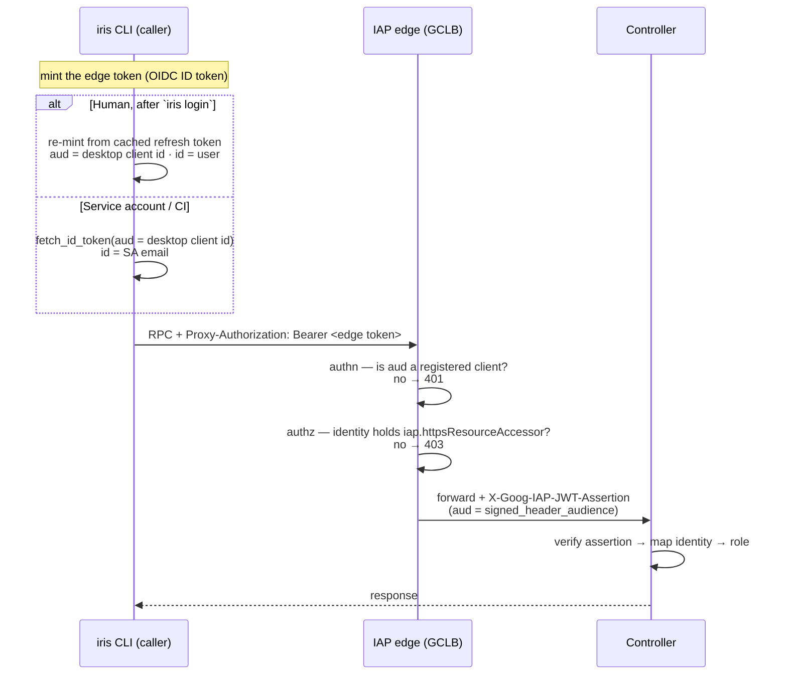

# IAP + GCLB ingress for the Iris controllers

`lib/iris/scripts/iap_gclb.py` stands up an external HTTPS Load Balancer (GCLB)
with Identity-Aware Proxy (IAP) in front of the running Iris controller VMs.
GCLB terminates TLS, IAP authenticates the caller against an IAM allowlist, and
the backend forwards plain HTTP to the controller on port `10000`. The
controller port is reachable **only** from Google's load-balancer ranges, so
every request arrives pre-authenticated by IAP.

```
client --HTTPS:443--> GCLB --(IAP gate)--> backend --HTTP:10000--> controller VM
```

## Topology: one shared frontend, one backend per cluster

A single **shared frontend** carries every cluster:

- a global static IP (cluster domains' DNS A records all point here),
- a URL map that routes by `Host` header to per-cluster backends,
- an HTTPS proxy holding every cluster's managed cert,
- a `:443` forwarding rule.

The frontend is named after the cluster that first stood it up
(`SHARED_FRONTEND`, currently `marin`): its resources are `iris-marin-ip`,
`iris-marin-urlmap`, `iris-marin-https-proxy`, `iris-marin-fr`.

Each cluster contributes a **backend**: a zonal NEG to its controller VM, a
health check, an IAP-gated backend service (`iris-<cluster>-be`), a managed cert
for its domain, and a host rule in the shared URL map. The frontend-owning
cluster is the URL map's default service, so it needs no host rule; every other
cluster routes by domain:

| Host             | Backend service     | Cluster    |
| ---------------- | ------------------- | ---------- |
| `iris.oa.dev`    | `iris-marin-be`     | marin (default) |
| `iris-dev.oa.dev`| `iris-marin-dev-be` | marin-dev  |

The controller VM is found by its GCE label / network tag
(`iris-<cluster>-controller`), which the script uses to discover its IP and to
firewall the port. Every stage is an idempotent `gcloud` create guarded by an
existence probe, so the full `deploy` or any single stage is safe to re-run.

This assumes the controller VM already exists (see `setup_iam.py` for the
service-account / project-IAM bootstrap that precedes it).

## Prerequisite: two OAuth clients (one-time, by hand)

The IAP OAuth Admin API is being turned down, so the script does **not** create
OAuth clients. Create both under **APIs & Services → Credentials** in the Cloud
Console and pass their downloaded JSON secrets to `deploy`:

- **Web** client — IAP's anchor and the browser sign-in page. Add the redirect
  URI `https://iap.googleapis.com/v1/oauth/clientIds/<CLIENT_ID>:handleRedirect`.
- **Desktop** client — what the `iris` CLI drives for browser login. Its id is
  registered in the Web client's `programmaticClients`, so IAP admits the CLI's
  bearer ID token (whose `aud` is the desktop client id).

The **same** client pair can protect every cluster's backend service; reuse them
across clusters rather than minting one set per cluster.

## Bootstrap

Deploy the frontend-owning cluster first (it creates the shared frontend), then
each additional cluster (each adds its backend + host route):

```bash
# marin — owns the shared frontend; its backend is the URL map default.
uv run lib/iris/scripts/iap_gclb.py deploy marin \
    --domain iris.oa.dev \
    --web-client-secrets web.json \
    --desktop-client-secrets desktop.json \
    --member user:you@example.com

# marin-dev — adds a backend + a host rule (iris-dev.oa.dev) on the shared LB.
uv run lib/iris/scripts/iap_gclb.py deploy marin-dev \
    --domain iris-dev.oa.dev \
    --web-client-secrets web.json \
    --desktop-client-secrets desktop.json \
    --member user:you@example.com
```

`deploy` runs the stages in dependency order — `cert` (managed SSL) → `backend`
(NEG → health check → backend service) → `iap` (enable + bind clients) →
`address` (shared IP) → URL map + host `route` → HTTPS proxy (attach cert) →
`:443` forwarding rule — then prints the shared IP, the URL, and the `auth.iap`
block to paste (see below). It finds the controller VM from the
`iris-<cluster>-controller` label; override its IP with `--controller-ip`. Add
`--dry-run` to trace every `gcloud` command without running it.

Two steps `deploy` does **not** do for you:

1. **DNS A record** — point the cluster's domain at the shared static IP. The
   managed SSL cert stays `PROVISIONING` until that resolves.
2. **Firewall** — run the `firewall` stage (or pass `--with-firewall`) so the LB
   health check can reach the controller. Without it the backend stays
   `UNHEALTHY`. It is kept separate because its deny-public option is a footgun
   (see [Firewall](#firewall)).

Individual stages are subcommands, each runnable on its own and idempotent; run
`uv run lib/iris/scripts/iap_gclb.py --help` for the full list. `status <cluster>`
reports what exists for the shared frontend and that cluster's backend (including
its proxy certs and JWT audience); `teardown <cluster>` removes a cluster's
backend + route + cert, leaving the shared frontend for the others.

## Cluster config

Enable IAP on the cluster by pasting the printed block into its config and
setting `auth.iap.signed_header_audience` to the backend-service audience (also
printed by `status`):

```yaml
auth:
  iap:
    url: https://iris.oa.dev
    oauth_client_id: <DESKTOP_CLIENT_ID>.apps.googleusercontent.com
    oauth_client_secret: <DESKTOP_CLIENT_SECRET>      # non-confidential, RFC 8252 §8.5
    audiences:
      - <DESKTOP_CLIENT_ID>.apps.googleusercontent.com
    # Optional: a dedicated aud for service-account (CI) callers. Omit to fall
    # back to the desktop client id, which IAP admits as a programmatic client.
    # programmatic_audiences:
    #   - <IAP_SECURED_CLIENT_ID>.apps.googleusercontent.com
    signed_header_audience: /projects/<PROJECT_NUMBER>/global/backendServices/<BACKEND_ID>
  admin_users:
    - you@example.com
  optional: false   # tokenless calls that did NOT pass IAP are still rejected
```

A full template is in `lib/iris/config/examples/iap.yaml`. The audience is
per-cluster — it names that cluster's backend service, not the shared frontend.
The controller verifies IAP's signed `X-Goog-IAP-JWT-Assertion` (its `aud` is
`signed_header_audience`) to map a request to an identity; leave that field empty
to disable the IAP path entirely. For how the controller turns an identity into a
role (`dashboard` read-only for an unprovisioned email vs `user`/`admin` for a
provisioned one, resolved per request from the assertion — the controller mints no
token), see `lib/iris/src/iris/rpc/auth.py` and `lib/iris/docs/auth-loopback-transition.md`.

## Access control

IAP admits a request only if the authenticated Google identity holds
`roles/iap.httpsResourceAccessor` on the **cluster's** backend service — that
binding is the allowlist, and it is granted per backend. Grant principals with
the `grant` stage:

```bash
uv run lib/iris/scripts/iap_gclb.py grant marin --member group:team@example.com
```

- `user:alice@example.com` — one person
- `group:team@example.com` — **recommended**: manage access by group membership
- `domain:example.com` — a whole Workspace org

Authentication is not authorization: any Google account can sign in, but an
identity not on the allowlist is rejected by IAP with `403` before the request
reaches the controller.

## How a caller is admitted: audience vs. identity

Every edge token an IAP caller presents carries two claims that IAP checks
**independently**, and conflating them is the classic way to misdiagnose an auth
failure:

- **Audience (`aud`) → authentication.** "Is this a token I recognize?" IAP
  admits a bearer OIDC token only if its `aud` is one of the OAuth clients
  registered on the backend — the Web anchor client, or any id in the Web
  client's `programmaticClients` (the desktop client is registered there, so
  `aud = <desktop client id>` is accepted). A token with an unrecognized `aud`,
  or no token at all, is rejected with **`401`**.
- **Identity (`email`/`sub`) → authorization.** "Is this caller allowed?" The
  authenticated identity must hold `roles/iap.httpsResourceAccessor` on the
  cluster's backend service (the allowlist above). An identity not on the
  allowlist is rejected with **`403`**.

These are orthogonal. Granting a service account the allowlist role (identity)
does nothing if the client never attaches an edge token (audience) — the request
dies at the `401` step, before authorization is ever consulted. That exact
gap — a cluster whose config listed only the desktop id, leaving the
service-account path with no audience to mint against — caused the CI `401`
outage this section documents.

### The three caller paths

The `aud` is always a client IAP registers; only the **identity** and how the
token is minted differ. Resolution lives in `rigging/credentials.py`
(`_edge_provider`) and `iris/cli/connect.py` (`_cluster_auth_from_config`):

| Caller | Token source | `aud` | Identity |
| ------ | ------------ | ----- | -------- |
| **Human** (after `iris login`) | re-mint from the cached desktop-OAuth refresh token (`IapRefreshTokenProvider`) | desktop client id | the signed-in user |
| **Service account** (GCE metadata / key / impersonated ADC) | mint an ID token from the ambient SA credentials the resolver finds — a key, GCE metadata, or an impersonated ADC (`IapServiceAccountTokenProvider`) | dedicated programmatic audience if the cluster configures one, else the desktop client id | the SA email |
| **Loopback / in-cluster** | none — reaches the controller directly, trusted by `auth.trusted_cidrs` / loopback | — | transport-trusted |



**Config takeaway.** `auth.iap.audiences` and `auth.iap.programmatic_audiences`
are independent: `audiences` lists the interactive-login `aud`s the controller
verifies, while `programmatic_audiences` lists the `aud`s a service account mints
its edge token for. Leave `programmatic_audiences` empty and the service-account
path falls back to the desktop client id (IAP registers it as a programmatic
client) — sufficient for the common single-client setup. Set it only to give
machine callers an `aud` distinct from the interactive-login client.

### Headless / CI / agent: give the process service-account credentials

The ambient-SA row above is automatic on a GCE VM whose service account is
allowlisted. Off a VM — a CI runner, a dev box, an agent harness — there is no
ambient service-account key, and the one credential you do have (your own
`gcloud` user login) does **not** work directly: `IapServiceAccountTokenProvider`
mints the edge token from *service-account* credentials, not end-user `gcloud`
credentials, and `iris login` (the only path that turns a *human* identity into an
edge token) needs a browser somewhere.

So a fully unattended caller authenticates *as an allowlisted service account*.
The keyless way is to point your application-default credentials at one by
impersonation — your ordinary user login is the impersonation source, nothing is
downloaded:

```bash
gcloud auth application-default login \
  --impersonate-service-account=iris-controller@hai-gcp-models.iam.gserviceaccount.com

iris --cluster=marin-dev cluster status   # just works; no iris-specific flag or env
```

`iris` reads that ADC through the standard Google resolver — `fetch_id_token`
ignores the well-known ADC file, so `IapServiceAccountTokenProvider` mints the
token through `google.auth.default()` for any ADC that carries service-account
impersonation: the `gcloud ... --impersonate-service-account` ADC above, or a
Workload Identity Federation external-account ADC whose config sets a
`service_account_impersonation_url`. On a GCE/GKE/Cloud Run workload, attach the
SA instead (metadata; zero files); in external CI, use Workload Identity
Federation — e.g. GitHub Actions with `google-github-actions/auth` configured
with `workload_identity_provider` and `service_account`, which writes exactly
such an external-account ADC. A downloaded SA key
(`GOOGLE_APPLICATION_CREDENTIALS=key.json`) also works but is a long-lived secret —
avoid it.

Two IAM grants make this work, matching the audience-vs-identity split above:

- **Impersonation** — you need `roles/iam.serviceAccountTokenCreator` on the
  target service account (to mint tokens as it).
- **Allowlist (identity → authorization)** — the service account must hold
  `roles/iap.httpsResourceAccessor` on the cluster's backend service, exactly as
  a human would (see [Access control](#access-control)). The edge token's `aud`
  clears IAP authentication; the impersonated SA email is the identity IAP
  authorizes and the controller maps to a role. There is no way to present a
  *non*-allowlisted identity — so the SA you impersonate must be on the allowlist.

To reach a plain HTTP endpoint (e.g. `/auth/config`) rather than an RPC, build
credentials with `iris.cli.connect.client_credentials(config, name)` and attach
`Proxy-Authorization: Bearer <creds.iap_provider.get_token()>`.

## Firewall

`firewall` tags the controller VM and adds an **allow** rule so only the Google
front-end / health-check / IAP ranges (`130.211.0.0/22`, `35.191.0.0/16`) reach
the controller port. This is additive and required — the health check never
passes without it. It is per-cluster (it targets that cluster's controller tag).

`firewall --deny-public` *also* adds a blanket `deny 0.0.0.0/0 → :10000`. This is
**not** additive: it sits above `default-allow-internal` and so also blocks
in-cluster traffic. On the marin cluster workers dial the controller's internal
IP on `:10000`, so a blanket deny would sever them — only enable it once internal
access is carved out (allow the RFC1918 ranges at a higher priority) or confirmed
unused. Without any deny rule the port is still not internet-reachable (no public
allow rule exists); the deny only makes that guarantee explicit.

## Capability-URL proxy (open only `/proxy/t/*` off-cluster)

By default the whole controller sits behind IAP, so an off-cluster caller (e.g. a
Daytona/Modal sandbox running an agent harness) cannot reach a registered
endpoint through the controller proxy. IAP is all-or-nothing per backend — it
authenticates *every* request to a backend or none — so it can't "attach the
caller's identity when present, else pass through anonymous" on a single path.
The `token-proxy` stage works around that by opening only the *capability-URL*
path `/proxy/t/*` past IAP, leaving the dashboard, `/auth/*`, the RPC mounts, and
every identity-gated `/proxy` path (including the dashboard's own
`/proxy/system.log-server/…` log fetch) IAP-gated:

```
                       ┌─ path /proxy/t/*  → iris-<cluster>-proxy-be  (IAP OFF) ─┐
client → GCLB (:443) → URL map                                                    ├→ same NEG → controller VM:10000
                       └─ default          → iris-<cluster>-be        (IAP ON) ──┘
```

A **capability URL** carries a scoped endpoint token in its path —
`/proxy/t/<token>/<endpoint>/<sub_path>` — so possession of the URL *is* the
credential (gist-style: if you have the link, it works). No auth header or cookie
is needed. The native Iris listener lifts the token from the path and verifies
that it is scoped to that endpoint and unexpired before forwarding. Mint one
with `iris endpoints mint <name>` (or let `marin-serve
--access link` print the ready-to-use URL at launch).

The stage adds a second backend service (`iris-<cluster>-proxy-be`, IAP disabled)
on the same NEG and health check the `backend` stage already created — no new NEG,
no new controller — and a URL-map path rule routing `/proxy/t` and `/proxy/t/*` to
it. Everything else on the host keeps flowing to the IAP-gated backend, so the
browser's IAP identity still reaches PRIVATE endpoints and the dashboard's log
viewer. The controller's native listener is the sole gate for the capability
path; it needs no firewall or IAP-admin authority, and this admin-run stage is
the only thing that touches the LB.

`deploy` runs `token-proxy` by default (it reuses the cluster's existing NEG +
health check), so a plain deploy or re-deploy stands up the `/proxy/t` opening
idempotently:

```bash
uv run lib/iris/scripts/iap_gclb.py deploy marin-dev --domain iris-dev.oa.dev \
    --web-client-secrets scratch/web.json \
    --desktop-client-secrets scratch/desktop.json

# Opt out to keep the controller fully IAP-gated (no off-cluster capability URLs):
#   ... deploy ... --no-token-proxy

# Or run just this stage against an already-deployed cluster:
uv run lib/iris/scripts/iap_gclb.py token-proxy marin-dev --domain iris-dev.oa.dev
```

`token-proxy` is idempotent (a no-op once the backend + path rule exist).
`teardown` removes the IAP-free backend and its `/proxy/t/*` rule along with the
rest of the cluster's stack; `status` reports whether the token-proxy backend
exists.

The firewall allow-rule still admits only the Google LB ranges, so nothing
bypasses the LB; opening `/proxy/t/*` only changes *which* GCLB backend that path
lands on, and the controller's native listener remains the sole gate.

On CoreWeave/k8s clusters there is no IAP layer: the controller Service is
ClusterIP-internal and a single Traefik ingress already routes all of `/proxy`
(including `/proxy/t/*`) to it with no edge auth, so the controller's own
native per-endpoint auth is the sole gate there and no equivalent stage is
needed.

## Verify

```bash
# Direct to the VM's external IP:10000 — connection times out (firewall drops it).
curl --connect-timeout 8 http://<CONTROLLER_EXTERNAL_IP>:10000/health

# Through the load balancer — IAP intercepts before the controller.
curl -i https://iris.oa.dev/                 # → 302 to accounts.google.com

# The only allow rule for :10000 is the Google LB range.
gcloud compute firewall-rules list --filter='allowed.ports:10000' \
  --format='table(name, sourceRanges.list(), targetTags.list())'
```

A `302` (browser) or `401` (RPC) carrying `x-goog-iap-generated-response: true`
means IAP answered and the request never reached the controller; a timeout on the
direct `:10000` probe confirms the port is closed to the public internet.
